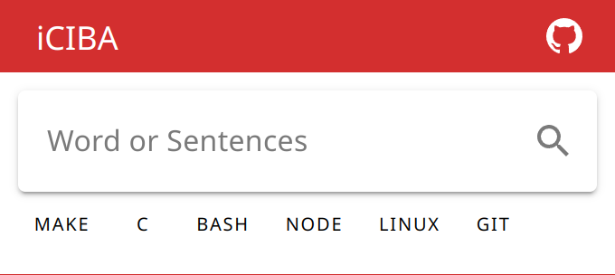

# iciba-chrome

A Chrome extension for iCIBA.

English | [中文](./README_ZH.md)



## Installation

[Chrome](https://chrome.google.com/webstore/detail/iciba/eknklfmpancpjepiepnopoedekiifklh)

[Edge](https://microsoftedge.microsoft.com/addons/detail/iciba/oigpeonhjfeabejhmingbagjpadnjmhc)

## Development & Building

### Requirements

- Node.js `24.17.0`
- pnpm `11.8.0`
- Vite Plus CLI from project dependencies (`vp`)

```sh
$ git clone https://github.com/TaipaXu/iciba-chrome.git
$ cd iciba-chrome
$ pnpm i
```

### Scripts

```sh
# Build once. The Chrome extension output is written to dist/.
$ pnpm run build

# Build in watch mode for extension development.
$ pnpm run dev

# Run type checking, oxlint and Vue template linting.
$ pnpm run lint

# Format files with Vite Plus oxfmt and ESLint template fixes.
$ pnpm run format
```

After building, load the `dist` directory as an unpacked extension in Chrome or Edge.

## License

[GPL-3.0](LICENSE)
